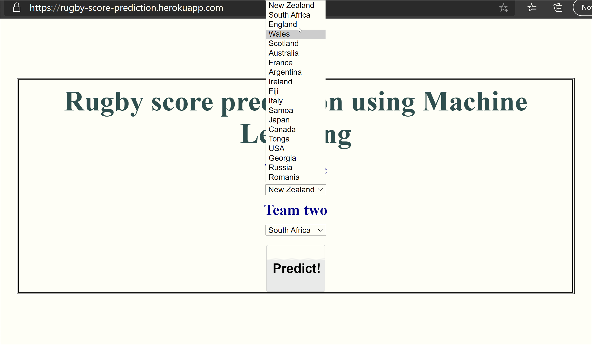

# Rugby score prediction
An end-to-end machine learning web app to predict rugby scores 

## Overview
An demo project to provide a high-level overview of the key steps needed in going from raw data to a live deployed machine learning app.

### What is covered
- Data wrangling with Pandas & data storage with SQLite
- Machine learning (Neural Network) with Keras
- Web app with Flask (and a bit of CSS & HTML)
- App deployment with Docker and Heroku

Read more here: https://towardsdatascience.com/an-end-to-end-machine-learning-project-with-python-pandas-keras-flask-docker-and-heroku-c987018c42c7

